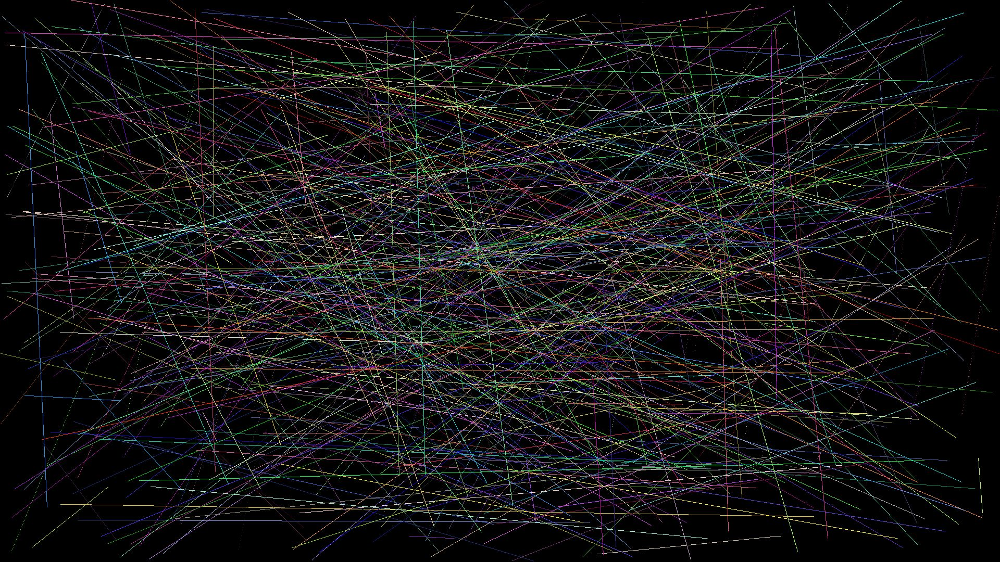

## Practice: drawing a line

On this practice, we draw a line on a "canvas" with different algoritms, some more efficient than the other one. In this case, we've implement these algorithms:
+ [Bresenham's Algorithm](https://en.wikipedia.org/wiki/Bresenham%27s_line_algorithm)
+ [DDA Algorithm](https://en.wikipedia.org/wiki/Digital_differential_analyzer_(graphics_algorithm))
+ [Naive line drawing Algorithm](https://en.wikipedia.org/wiki/Line_drawing_algorithm)

## Sample output image

This is a image rendered by the program generating 500 random lines with a random color.

This image was rendered with the Naive Algorithm.

