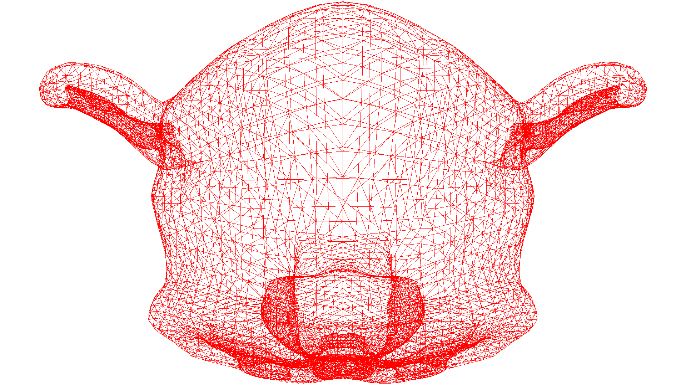
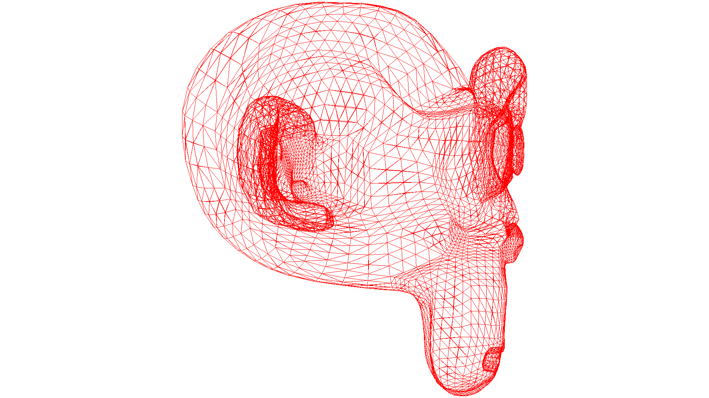

# Practice: Perspective projection

Image rendered with the Bresenham Algorithm. I've take advantage of my CPU 3 cores to render the perspective views at the same time.

### XY View

### XZ View

### ZY View
