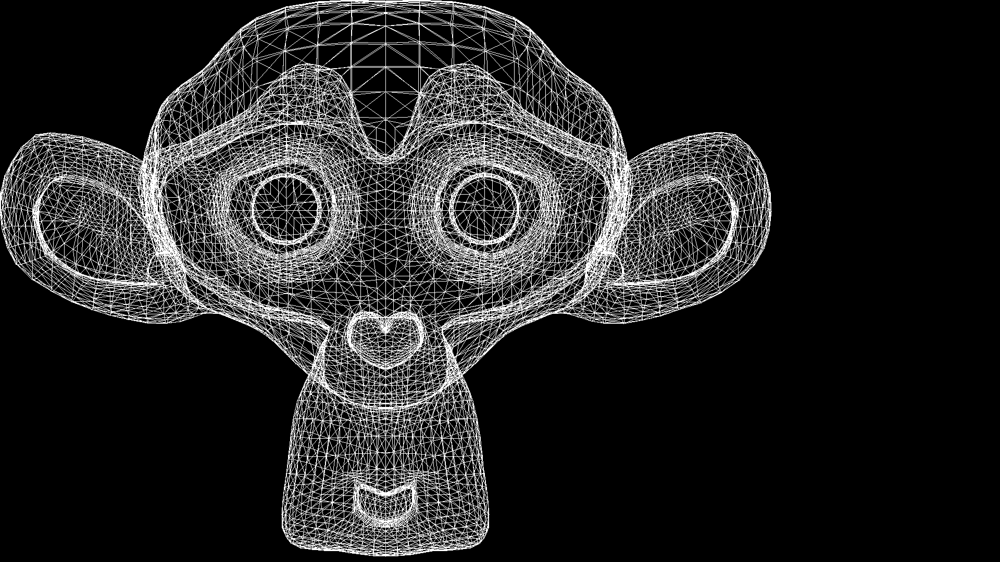

# Practice: Read a Blender Object (.obj file)

Image rendered with the Bresenham algorithm. The program reads a file with .obj extension and takes the vertex and face data to draw the model in a rudimentary way.

### Suzanne Model
