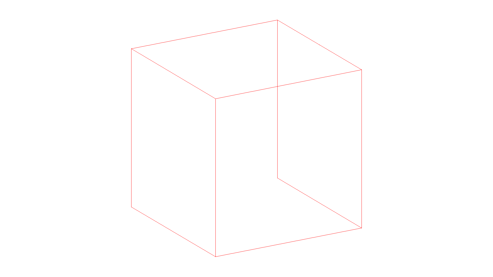

# Practice: Make a .VLF parser

This practice is divided by two parts

## Part 1: Triangulation
The hardest part. I needed to implement an algorithm to convert polygons with n sides into triangles. This was easy with squares, but with n-sided polygons it was a bit difficult. In the end, I was able to pull this off.

### Square without triangles


### Square with triangles


## Part 2: VLF export

The easiest part. I created new structures called Face and Edge, to better manage the VLF. I also added new attributes, called index, to the structures, to be able to write the VLF file fulfilling the file requirements.

### Preview: header of VLF

```
00000000  80 b5 00 00 80 b5 00 00  80 3c 00 00 bd fc d6 3e  |.........<.....>|
```
The first 8 bytes are to represent the size of the model vertices. `` 80 b5 00 00 `` = 46464 vertices. 

The next 8 bytes are to represent the size of the model edges. `` 80 b5 00 00 `` = 46464 edges. 

The next 8 bytes are to represent the size of the model faces. `` 80 3c 00 00 `` = 15488 faces. 

**These values are from the Suzanne model.**

### Preview: X, Y, Z coordinates
```
...
00000010  09 33 5d be 49 2d 50 3f  c1 6f db 3e c0 cc 77 be  |.3].I-P?.o.>..w.|
00000020  c5 57 4f 3f 7b 6b c8 3e  69 e0 77 be b4 73 52 3f  |.WO?{k.>i.w..sR?|
00000030  7b 6b c8 3e 69 e0 77 be  b4 73 52 3f 94 89 c3 3e  |{k.>i.w..sR?...>|
00000040  e4 f9 5c be d5 eb 52 3f  bd fc d6 3e 09 33 5d be  |..\...R?...>.3].|
00000050  49 2d 50 3f 3d f0 d1 3e  a5 db 42 be ea 5d 50 3f  |I-P?=..>..B..]P?|
00000060  bd fc d6 3e 09 33 5d be  49 2d 50 3f 94 89 c3 3e  |...>.3].I-P?...>|
00000070  e4 f9 5c be d5 eb 52 3f  94 89 c3 3e e4 f9 5c be  |..\...R?...>..\.|
00000080  d5 eb 52 3f 7b 6b c8 3e  69 e0 77 be b4 73 52 3f  |..R?{k.>i.w..sR?|
00000090  ef ff b3 3e 22 00 78 be  00 00 54 3f bd fc d6 3e  |...>".x...T?...>|
...
```
### Preview: edges indexes of the coordinates

``` 
...
00088210  01 00 00 00 01 00 00 00  02 00 00 00 02 00 00 00  |................|
00088220  00 00 00 00 03 00 00 00  04 00 00 00 04 00 00 00  |................|
00088230  05 00 00 00 05 00 00 00  03 00 00 00 06 00 00 00  |................|
00088240  07 00 00 00 07 00 00 00  08 00 00 00 08 00 00 00  |................|
00088250  06 00 00 00 09 00 00 00  0a 00 00 00 0a 00 00 00  |................|
00088260  0b 00 00 00 0b 00 00 00  09 00 00 00 0c 00 00 00  |................|
00088270  0d 00 00 00 0d 00 00 00  0e 00 00 00 0e 00 00 00  |................|
00088280  0c 00 00 00 0f 00 00 00  10 00 00 00 10 00 00 00  |................|
00088290  11 00 00 00 11 00 00 00  0f 00 00 00 12 00 00 00  |................|
000882a0  13 00 00 00 13 00 00 00  14 00 00 00 14 00 00 00  |................|
000882b0  12 00 00 00 15 00 00 00  16 00 00 00 16 00 00 00  |................|
000882c0  17 00 00 00 17 00 00 00  15 00 00 00 18 00 00 00  |................|
000882d0  19 00 00 00 19 00 00 00  1a 00 00 00 1a 00 00 00  |................|
000882e0  18 00 00 00 1b 00 00 00  1c 00 00 00 1c 00 00 00  |................|
000882f0  1d 00 00 00 1d 00 00 00  1b 00 00 00 1e 00 00 00  |................|
00088300  1f 00 00 00 1f 00 00 00  20 00 00 00 20 00 00 00  |........ ... ...|
00088310  1e 00 00 00 21 00 00 00  22 00 00 00 22 00 00 00  |....!..."..."...|
00088320  23 00 00 00 23 00 00 00  21 00 00 00 24 00 00 00  |#...#...!...$...|
00088330  25 00 00 00 25 00 00 00  26 00 00 00 26 00 00 00  |%...%...&...&...|
...
```


**And so on...**